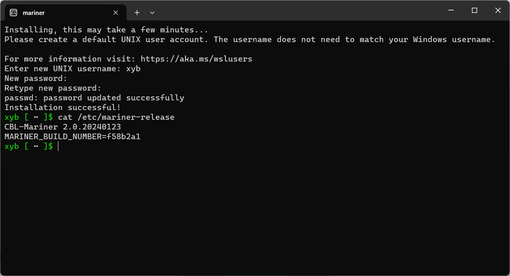

# WSL-Mariner
WSL distribution for CBL-Mariner (Azure Linux)

## Generate Mariner root file system

    cd src
    docker run -t wsl-mariner .

Then you can copy the generated file out from the docker. For example, copy to `d:\tmp\install.tar.gz`:

    docker run -v d:\tmp:/mnt/dst --rm --entrypoint cp wsl-mariner /tmp/install.tar.gz /mnt/dst/

## Install

1. Create a folder to put WSL-Mariner files:

        mkdir d:\wsl\mariner

1. Download WSL Launcher form https://github.com/xieyubo/WSL-DistroLauncher/releases/download/0.9.1/wsl-launcher.exe
   to `d:\wsl\mariner`.

1. Copy the `install.tar.gz` to `d:\wsl\mariner` also.

1. Double click `wsl-launcher.exe`

